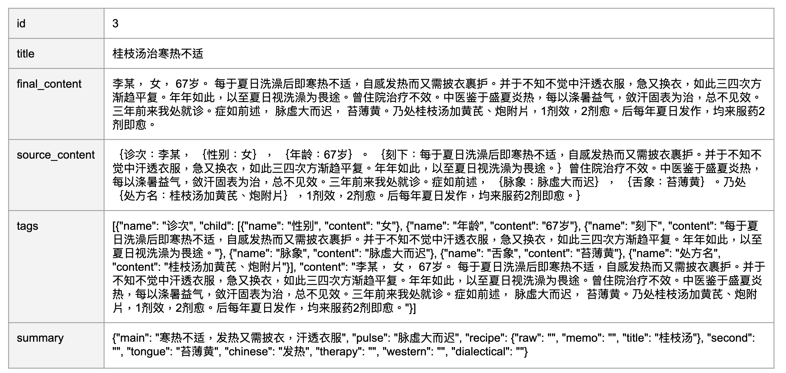
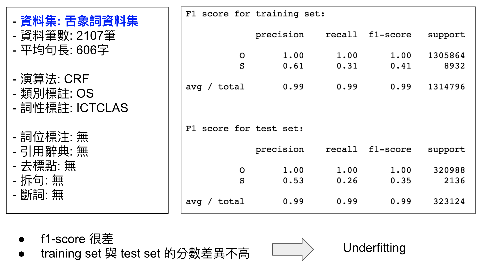
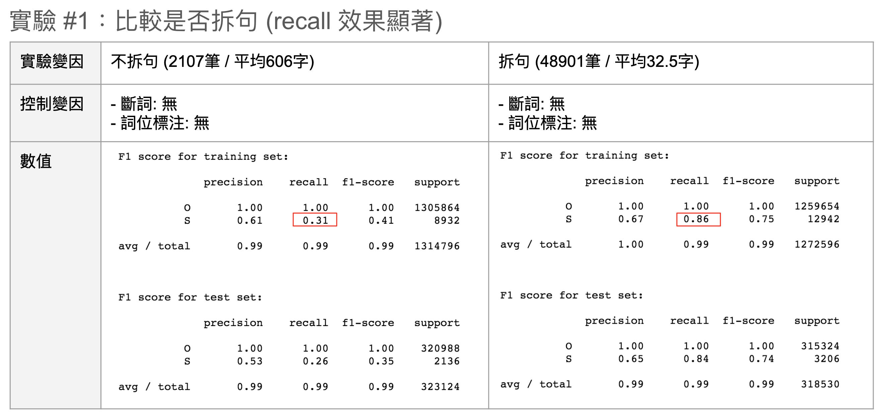
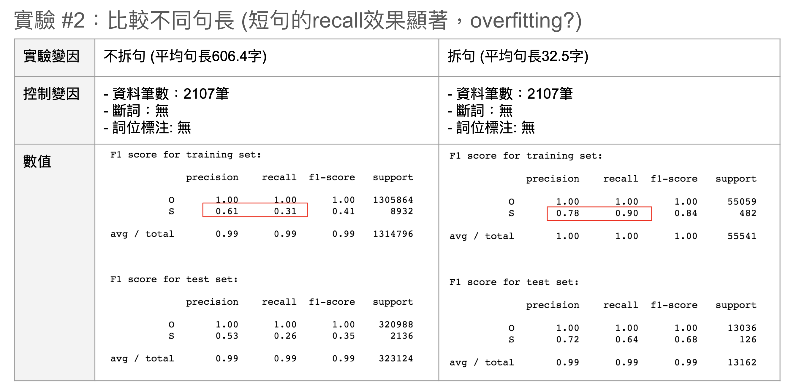
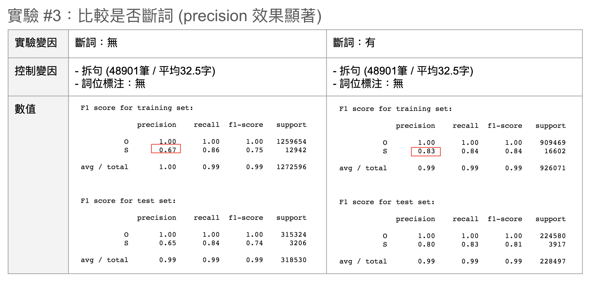
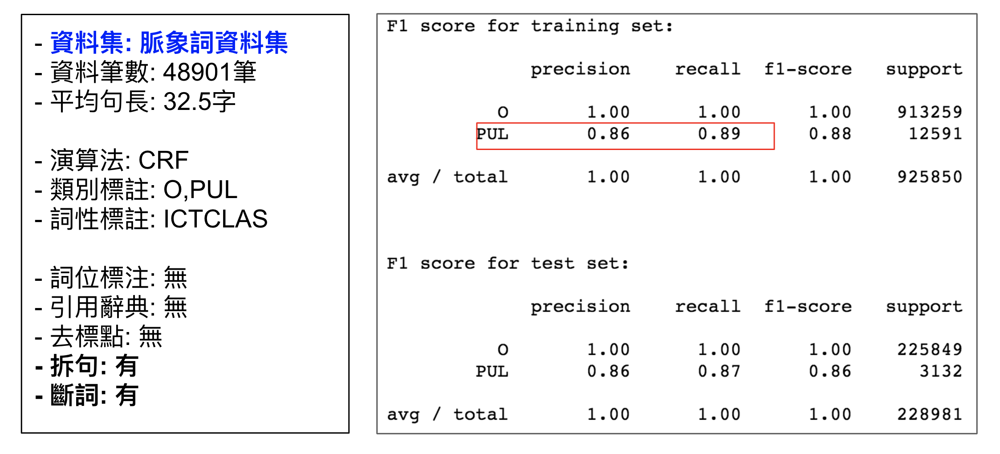
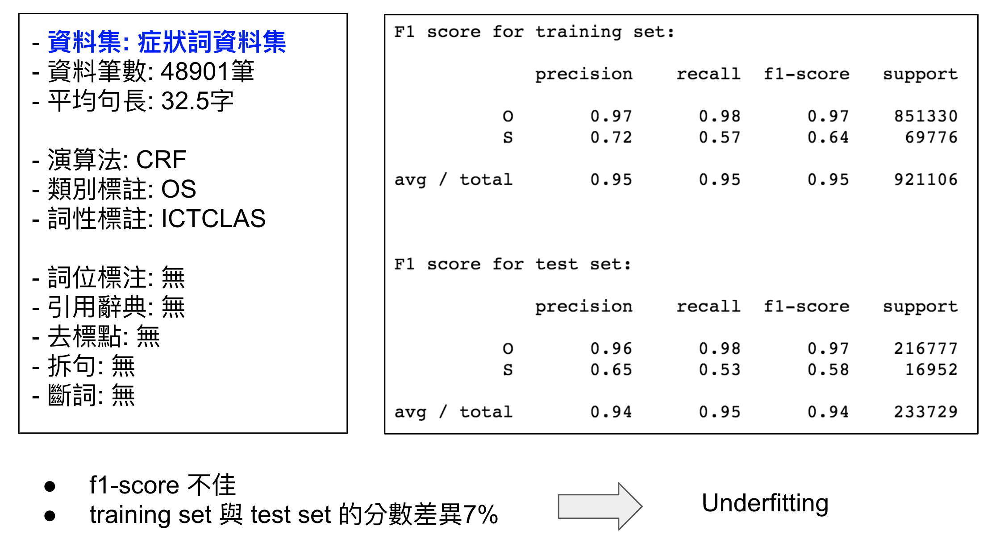

# 中醫醫案術語抽取

### 資料集
- 資料提供者：中醫在線 (北京果壳宇宙教育科技有限公司)
- 簡述：傳統中醫醫案的人工摘要，以利使用者快速找到症狀相符之醫案
- 檔名：case_summary_180910.xls
- 檔案格式：Mocrosoft Excel File
- 內容格式：共6個欄位(id, title, final_content, source_content, tags, summary)
- 資料筆數：共2107筆

### 資料集 - 範例

### 預處理
- 移除標點
- 拆分為句
  - 以全形句點(。)將醫案拆分為句(sentence)，以句子作為資料點。
  - 拆分後共得48901筆，平均句長32.5個字。
- 詞位標注
  - 標注集：OS, OSBIE
  - 實體類別：SYM(合併主證與兼證), PUL(脈象), TON(舌象)
- 逐字標註
  - 共有3235個症狀詞(TON)，其中43個詞沒有完全對應，皆標為O。
  - 範例
    - content：脉细，苔薄黄
    - tongue : “苔薄黄”
    - 標注結果：脉O细O，O苔TON薄TON黄TON

### 模型訓練
- 模型：條件隨機場(CRF)
- 工具包：python-crfsuite
- 詞性標注系統：NLTK, ICTCLAS
- 資料集
  - 將症狀,脈象,舌象分別標註為三個資料集
    - 症狀詞資料集：SYM
    - 脈象詞資料集：PUL
    - 舌象詞資料集：TON
  - 將資料集切分為訓練集和測試集
    - 80%作為訓練集(39120筆)
    - 20%作為測試集(9781筆)
- 特徵：字本身, 前一個字, 後一個字, 詞性

### 實驗結果
- 舌象詞資料集

- 脈象詞資料集

- 症狀詞資料集

